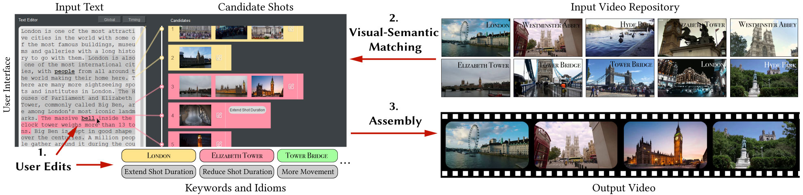

<!-- 
<h3><b>Write-A-Video: Computational Video Montage from Themed Text</b></h3>
 -->

### **Write-A-Video: Computational Video Montage from Themed Text**

<!-- 
<h4><b>SIGGRAPH Asia 2019</b></h4>
 -->

#### **SIGGRAPH Asia 2019**

 

##### **Miao Wang**, State Key Laboratory of Virtual Reality Technology and Systems Beihang University; Tsinghua University

##### **Guo-Wei Yang**, BNRist, Tsinghua University

##### **Shi-Min Hu**, BNRist, Tsinghua University

##### **Shing-Tung Yau**, Harvard University

##### **Ariel Shamir**, IDC Herzliya

 
<!--  -->

 

#### **Abstract**

We present Write-A-Video, a tool for the creation of video montage using
mostly text-editing. Given an input themed text and a related video repository either from online websites or personal albums, the tool allows novice
users to generate a video montage much more easily than current video
editing tools. The resulting video illustrates the given narrative, provides
diverse visual content, and follows cinematographic guidelines. The process involves three simple steps: (1) the user provides input, mostly in the
form of editing the text, (2) the tool automatically searches for semantically
matching candidate shots from the video repository, and (3) an optimization
method assembles the video montage. Visual-semantic matching between
segmented text and shots is performed by cascaded keyword matching and
visual-semantic embedding, that have better accuracy than alternative solutions. The video assembly is formulated as a hybrid optimization problem
over a graph of shots, considering temporal constraints, cinematography
metrics such as camera movement and tone, and user-specified cinematography idioms. Using our system, users without video editing experience are
able to generate appealing videos.

 

#### **Paper**

Miao Wang, Guo-Wei Yang, Shi-Min Hu, Shing-Tung Yau and Ariel Shamir. Write-A-Video: Computational Video Montage from Themed Text. ACM Transactions on Graphics (Proc. SIGGRAPH Asia), 38 (6), Article No. 177, 2019. <a href = "../papers/a177-wang.pdf"> PDF </a> |
<a href = "../papers/writeavideo.bib">BibTeX</a> 

 

#### **Downloads**

<a href = "">Supplementary Video</a> |
<a href = "">Interaction Video</a> |
<a href = "">More Results Coming Soon</a> 

 

<!-- 
 

<h4 style="font-family: 'aleSC', Helvetica Neue,Source Sans Pro,Arial"><b>Collaborators</b></h4>

Here are my lovely collaborators (and their homepages):

* [Prof. Shi-Min Hu @ Tsinghua University](http://cg.cs.tsinghua.edu.cn/prof_hu.htm)
* [Prof. Kun Xu @ Tsinghua University](http://cg.cs.tsinghua.edu.cn/people/~kun)
* Prof. Song-Hai Zhang @ Tsinghua University
* [Prof. Ariel Shamir @ IDC Israel](http://www.faculty.idc.ac.il/arik/site/index.asp)
* [Prof. Ralph Martin @ Cardiff University](https://www.cardiff.ac.uk/people/view/118143-martin-ralph)
* [Prof. Peter Hall @ University of Bath](http://www.cs.bath.ac.uk/~pmh/start/home.html)
* [Prof. Yu-Kun Lai @ Cardiff University](https://users.cs.cf.ac.uk/Yukun.Lai/)
* [Dr. Fang-Lue Zhang @ Victoria University of Wellington](https://ecs.victoria.ac.nz/Main/FanglueZhang)
* [Prof. Shao-Ping Lu @ Nankai University](http://www.shaopinglu.net/)
* [Prof. Tai-Jiang Mu @ Tsinghua University](http://cg.cs.tsinghua.edu.cn/people/~mtj)
* [Dr. Zhe Zhu @ Duke University](https://sites.duke.edu/zzhu/)
* Mr. Xi-Jin Zhang @ Toutiao AI Lab
* Mr. Xiao-Nan Fang @ Tsinghua University
* [Mr. Ruilong Li @ University of Southern California](http://www.liruilong.cn/) -->

<!-- 
<h4 style="font-family: Helvetica Neue,Source Sans Pro,Arial"><b>Courses</b></h4>

**Course Taught @ Tsinghua University**

* TA, Fundamental of Computer Graphics (Spring 2013)

 

<h4 style="font-family: Helvetica Neue,Source Sans Pro,Arial"><b>Students</b></h4>

 <i>I am always looking for passionate undergraduate interns to work with me. </i>

*I am always looking for passionate undergraduate interns to work with me.* -->

<!-- **Current students**

* Guo-Ye Yang, undergraduate intern, Tsinghua University, started 2015 (with Shi-Min Hu)
* Guo-Wei Yang, undergraduate intern, Tsinghua University, started 2016 (with Shi-Min Hu)
* Run-Ze Liang, undergraduate intern, Tsinghua University, started 2018 (with Shi-Min Hu)

**Alumni**

* Jun-Bang Liang, undergraduate intern, Tsinghua University, 2014-2015. Currently a PhD candidate at UNC-CH, United States.
* Jin-Kun Lin, undergraduate intern, Tsinghua University, 2016-2017. 
* Yu Fang, undergraduate intern, Tsinghua University, 2017. Currently a PhD candidate at University of Pennsylvania, United States.
* Shu-Yang Zhang, undergraduate intern, University of Michigan, United States, summer 2018.  -->

<!-- Our overarching goal is to explore and understand new quantum states of electronic matter on the atomic scale. To do so, we use and develop novel spectroscopic-imaging scanning tunneling microscopy (SI-STM) tools to visualize the relevant quantum mechanical degrees of freedom.

Questions of interest include: (i), How does the Mott state collapse upon doping and how is this related to the complex phase diagram of high-temperature superconductors? (ii), What is the strange metal phase seen in correlated electron systems? Is this an exotic long-range entangled state? What is the mechanism of dissipation in that state? (iii), Why is the transition temperature in high-temperature superconductors so high? 
 
{: style="width: 300px; float: right; border: 10px"}

Currently, our instrument of choice  is SI-STM.  State-of-the-art SI-STM measures an array of tunneling spectra on a given sample, registered to the atomic sites with picometer precision. Each is proportional to the local density of states at a given location. Ideally, the recorded spectra are so tightly packed that the measurement yields a three-dimensional mapping of the local density of states as a function of locations and energy. This is shown on the image on the right-hand side (10x10 nm2), and its Fourier transform, below.

The quantum materials which we will investigate encapsulate some of the great unsolved mysteries of physics. They include high-temperature superconductors, quantum-critical compounds, graphene, and topological electronic matter that can be used for error-resistant quantum computing.

{: style="width: 300px; float: left; border: 10px"}

A main goal is to use modern technology to build the new instrumentation needed to understand these quantum materials. I learned my trade in [Seamus Davis’ SI-STM lab](http://davisgroup.lassp.cornell.edu/) and with [Felix Baumberger](http://dpmc.unige.ch/gr_baumberger/index.html), and later moved as an [ETH fellow](http://www.ethfellows.ethz.ch/) to [Andreas Wallraff’s qudev lab](http://www.qudev.ethz.ch/) where we investigated coupled cavity arrays in circuit QED. This allowed me to learn new techniques such as high frequency measurements, low temperature noise-free amplification, and quantum-limited measurements. The goal is to combine these with SI-STM.

This will enable the instrumental capabilities to visualize the different quantum mechanical degrees of freedom needed to understand next-generation quantum materials. STM will be the main method, but we use different spectroscopic-imaging techniques to visualize not only the topography, but also the density of states, spins, and other degrees of freedom hidden below the surface.
 -->